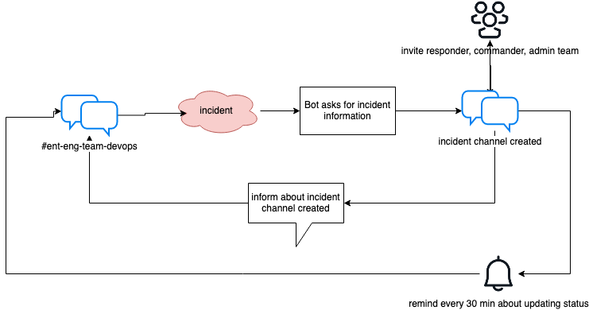
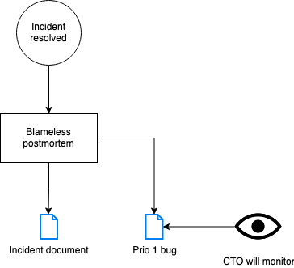

# Incident declaration automation
Devopsbot automates incident declaration:
- Incident responders and commanders should focus on the essential tasks of resolving the incident
- Automate the repetitive steps in the incident management process
- Keep affected stakeholders informed about the status of the incident
- Standardize and document the procedure to lay the foundation for something to be improved upon

An incident cannot be planned for, the nature of it is that it just happens.
Incidents happen all the time for everyone, it is an unfortunate but natural part of life.
That does not mean they can be taken for granted. Teams should have a process
for managing them and learn from them.

An incident is defined as something that:
- Negatively affects customers
- Was not planned for
- Cannot be resolved within 1 hour

## During incidents
The workflow during an incident is as follows:

## After incidents
When an incident has been declared as resolved, there is a need to communicate the resolution and
learn from the experience.

The workflow after an incident is suggested as follows:

